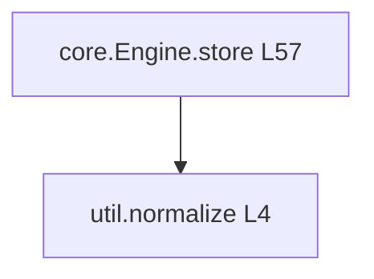

# py-ast-mcp

An MCP (Model Context Protocol) server for deep structural analysis of **Python** source code.

It is the Python counterpart to [ts-ast-mcp](https://github.com/gclluch/ts-ast-mcp) and mirrors its 20-tool surface as closely as Python semantics allow. Everything is built on the standard library `ast` module — no compilation, no type checker, no project configuration required. `jedi` is an optional extra used only for cross-file semantic resolution, and every tool degrades gracefully when it is not installed.

Unlike `grep`, this server understands actual structure: function signatures, class hierarchies, call relationships, cyclomatic complexity and unreferenced code.

## Features

- **Real AST, not regex** — signatures with annotations and defaults, decorators, async flags, positional-only and keyword-only parameters, nested definitions.
- **Python-aware classification** — dataclasses, enums, `Protocol`, `TypedDict`, `NamedTuple`, ABCs, exceptions and `TypeAlias` are recognised as distinct kinds.
- **Call graphs as Mermaid** — file-scoped or package-scoped flowcharts, rooted at a function, with optional external call edges.
- **Quality tooling** — cyclomatic complexity with ranks, scored to match `radon`/`mccabe`, code smells, and Python-specific hazards (mutable default arguments, bare `except`, late-binding loop closures, unawaited coroutines, `assert` used for validation).
- **Dead code across a directory** — unreferenced private and module-level symbols, with a confidence split between private and public names.
- **Protocol conformance** — finds implementations both explicitly (base class, including indirect subclasses) and structurally (method-set match).
- **Docstring parsing** — Google and NumPy styles are split into summary / params / returns / raises.
- **Structural diffing** — signature-level, not text-level: what actually changed in the API.
- **Model-friendly output** — dense, scannable plain text with line numbers everywhere, not raw JSON dumps.
- **Never crashes on bad input** — syntax errors come back as a readable error with line and column, flagged `isError` so a client can tell failure from analysis; the server stays up.
- **Parse caching** — modules are cached by path + mtime + size, so repeated tool calls in one turn are cheap.

## Installation

Requires Python 3.10+. Prefer the newest Python you have installed: the server can only parse syntax its own interpreter understands (see [Known limitations](#known-limitations)).

```bash
git clone <this-repo> py-ast-mcp
cd py-ast-mcp
pip install -e .

# optional: cross-file semantic resolution
pip install -e ".[semantic]"

# development (pytest + jedi)
pip install -e ".[dev]"
```

This installs a `py-ast-mcp` console script that runs the stdio server. `python -m py_ast_mcp` works too.

## Tools

All `path` arguments accept absolute paths or paths relative to the server's working directory.

### Structural

| Tool | Parameters | Description |
| --- | --- | --- |
| `analyze_file` | `path` | High-level summary of every symbol: classes (with dataclass/enum/Protocol/TypedDict classification), functions, async functions, methods and module-level assignments. |
| `list_functions` | `path` | All functions and methods with full signatures (annotations, defaults, return type, decorators, async flag) and line ranges. |
| `get_function_body` | `path`, `name` | Full numbered source of a function or method. Supports `Class.method` and dotted nested paths; falls back to base classes in the same file. |
| `list_methods` | `path`, `type` | All methods of a class: declared, properties, class/static methods, class attributes, and members inherited from base classes defined in the same file. |
| `get_type_definition` | `path`, `name` | Extract a class / `TypeAlias` / `Enum` / `Protocol` / `TypedDict` / `NamedTuple` definition with its members and source. |
| `list_declarations` | `path` | Module-level assignments with annotated or inferred types. |
| `list_exports` | `path` | Public API: respects `__all__` when present, otherwise non-underscore module-level names; flags re-exported imports and names in `__all__` that are not defined. |
| `list_imports` | `path` | All imports with bound name, module path, relative-import level and aliases, grouped into stdlib / third-party / relative. |
| `find_usages` | `path`, `identifier`, `context` (default `1`) | Every occurrence with surrounding source lines: reads, assignments, parameters, attribute access, imports, `global`/`nonlocal`. Adds project-wide references when `jedi` is installed. |

### Call analysis

| Tool | Parameters | Description |
| --- | --- | --- |
| `call_graph` | `path`, `function`, `direction` (`TD`/`TB`/`LR`/`RL`/`BT`, default `TD`), `include_external` (default `false`), `scope` (`file`/`package`, default `file`) | Mermaid flowchart of call relationships. `function` roots the graph at one function; `scope="package"` walks every `.py` file in the containing directory. Also lists edges in text form and functions with no edges. |
| `get_callers` | `path`, `function`, `scope` (`file`/`package`, default `file`) | Reverse call graph: direct callers with call sites, transitive callers, and the entry points that reach the function. |

### Quality

| Tool | Parameters | Description |
| --- | --- | --- |
| `code_complexity` | `path`, `function` | Cyclomatic complexity per function with an A–F rank. Counts `if`/`elif`, `for`, `while`, `for`/`try` `else`, `except`, comprehensions and their `if` clauses, boolean operators, ternaries and `match` cases. `with` and `assert` are not counted (neither branches), and nested `def`s are scored separately rather than folded into the parent — so scores match `radon cc --no-assert` exactly. Pass `function` for a decision-point breakdown. |
| `code_smells` | `path`, `function` | Long functions, deep nesting, god classes, too many parameters, mutable default arguments, bare `except:`, shadowed builtins, high complexity. Grouped by severity with a suggested fix. |
| `find_errors` | `path`, `function` | Python-specific hazards: bare/broad `except`, `except: pass`, mutable default args, unawaited coroutine calls (best effort), `assert` used for runtime validation, late-binding closures over loop variables, `==`/`!=` against `None`/`True`/`False`, methods that never use `self`. |
| `dead_code` | `path`, `include_tests` (default `false`) | Unreferenced private and module-level symbols across a directory. If `path` is a file, its containing directory is scanned so cross-file references are seen. |
| `find_implementations` | `path`, `interface` | Classes implementing a Protocol/ABC — explicit (direct or indirect base class) and structural (method-set match), plus near misses. The argument is `interface`, not `protocol`, so the same call works against `ts-ast-mcp`. |

### Docs & multi-file

| Tool | Parameters | Description |
| --- | --- | --- |
| `get_doc` | `path`, `name` | Docstring extraction for a function, `Class.method`, class, module (`name="module"`) or documented module constant. Google and NumPy styles are parsed into summary / description / params / returns / yields / raises. |
| `analyze_package` | `path`, `include_tests` (default `false`) | Directory-level summary of every `.py` file: line counts, class/function counts, docstrings, per-file symbol lists, and any unparseable files. |
| `diff_ast` | `old_path`, `new_path` | Structural diff: added / removed / modified functions, methods, classes, base classes, decorators, module variables, imports and `__all__`. Signature-level, with a "potentially breaking" summary. |
| `find_node_at_position` | `path`, `line` (1-based), `column` (0-based) | The AST node at a cursor position, the full node chain, and the enclosing scope chain. Adds jedi-resolved definitions when available. |

## Configuration

### Claude Code

Add a `.mcp.json` at the root of your project (this file is picked up automatically):

```json
{
  "mcpServers": {
    "py-ast": {
      "command": "py-ast-mcp",
      "args": []
    }
  }
}
```

If you installed into a virtualenv, point at it explicitly so the server does not depend on your shell's `PATH`:

```json
{
  "mcpServers": {
    "py-ast": {
      "command": "/absolute/path/to/venv/bin/python",
      "args": ["-m", "py_ast_mcp"]
    }
  }
}
```

Or run it straight from a checkout without installing, using `uv`:

```json
{
  "mcpServers": {
    "py-ast": {
      "command": "uvx",
      "args": ["--from", "/absolute/path/to/py-ast-mcp", "py-ast-mcp"]
    }
  }
}
```

You can also register it from the CLI:

```bash
claude mcp add py-ast -- py-ast-mcp
```

### Claude Desktop

Edit `claude_desktop_config.json`:

- macOS: `~/Library/Application Support/Claude/claude_desktop_config.json`
- Windows: `%APPDATA%\Claude\claude_desktop_config.json`
- Linux: `~/.config/Claude/claude_desktop_config.json`

```json
{
  "mcpServers": {
    "py-ast": {
      "command": "py-ast-mcp",
      "args": []
    }
  }
}
```

Because Claude Desktop does not inherit your shell environment, an absolute path is usually safer:

```json
{
  "mcpServers": {
    "py-ast": {
      "command": "/absolute/path/to/venv/bin/py-ast-mcp",
      "args": []
    }
  }
}
```

Restart Claude Desktop after editing the file.

### Straight from GitHub

No checkout, no install - `uv` fetches and runs it:

```json
{
  "mcpServers": {
    "py-ast": {
      "command": "uvx",
      "args": ["--from", "git+https://github.com/gclluch/py-ast-mcp", "py-ast-mcp"]
    }
  }
}
```

Add `--with jedi` to the args for cross-file semantic resolution.

## Example output

`call_graph` on a small package:

```
# call_graph (package)  samplepkg/core.py  [16 functions, 11 edges]

## mermaid


## edges
- Engine.store -> validate  @L58
- Engine.store -> normalize  @L59
- run_pipeline -> Engine.store  @L70
```

`code_complexity` on the standard library's `argparse`:

```
# complexity  /usr/lib/python3.11/argparse.py  [138 functions, module total 350]
average 3.7   max 46   functions over 10: 10

function                              lines       cc  rank  len  depth
------------------------------------  ----------  --  ----  ---  -----
ArgumentParser._parse_known_args      L1930-2187  46  F     258  6
HelpFormatter._format_actions_usage   L406-519    28  D     114  5
```

## Development

```bash
pip install -e ".[dev]"

# unit tests
pytest

# end-to-end: spawn the real server and drive it over stdio with a
# handwritten JSON-RPC client (initialize -> tools/list -> tools/call)
python scripts/stdio_smoke_test.py
```

Layout:

```
src/py_ast_mcp/
  server.py        MCP tool registration (FastMCP, stdio transport)
  parse.py         shared parse + cache by path/mtime/size, AST navigation
  format.py        shared output formatting
  analyze.py       analyze_file, analyze_package, find_node_at_position
  functions.py     list_functions, get_function_body, list_methods
  types.py         get_type_definition, list_declarations
  imports.py       list_imports, list_exports
  usages.py        find_usages
  callgraph.py     call_graph, get_callers
  complexity.py    code_complexity
  smells.py        code_smells
  errors.py        find_errors
  deadcode.py      dead_code
  protocols.py     find_implementations
  doc.py           get_doc
  diff.py          diff_ast
  jedi_support.py  optional cross-file resolution
```

## Known limitations

These are heuristics over a syntax tree, not a type checker:

- **The server parses with its own interpreter's grammar.** `ast` can only read syntax the running Python understands, so a server on 3.11 reports `PEP 695` code (`type X = ...`, `def f[T]()`) as a syntax error even though the file is valid. **Run the server on the newest Python you have**, regardless of what the target project targets — parse errors say so when the interpreter may be the cause.
- **Call resolution is name-based.** `obj.method()` is matched by method name; when several classes in scope define the same name the first one wins. `self.method()` resolves within the enclosing class and then across classes in the file.
- **Cross-module call edges** in `scope="package"` are resolved through `import` statements only. Dynamic dispatch, factories and callbacks are not followed.
- **`dead_code` matches by name, not by scope.** `getattr`, plugin registries, entry points and re-exports from outside the scan produce false positives; public symbols are reported separately as lower confidence. The larger risk is the other direction: any attribute access or string literal sharing a symbol's name marks it live, so the tool **under-reports**. Treat hits as candidates to confirm.
- **`jedi` resolution is scoped to the detected project root**, found by walking up for `.git` / `setup.py` / `requirements.txt`. Files outside that root are invisible to `find_usages`' cross-file section.
- **`unawaited-coroutine` is best effort.** It flags calls to `async def` functions declared in the same file that are neither awaited nor wrapped in a recognised `asyncio` helper.
- **Inherited members** are only resolved for base classes defined in the same file; bases from other modules are listed as unresolved.
- **`list_declarations` type inference is literal-shaped**, not a real inference engine: it reports what a reader would infer from the right-hand side.

## License

MIT
